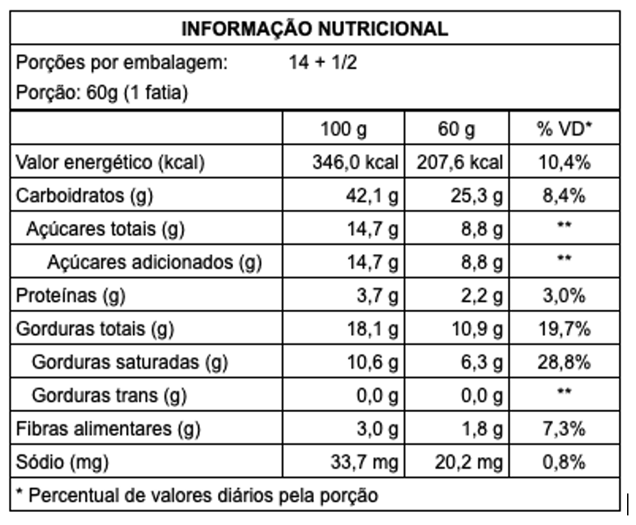
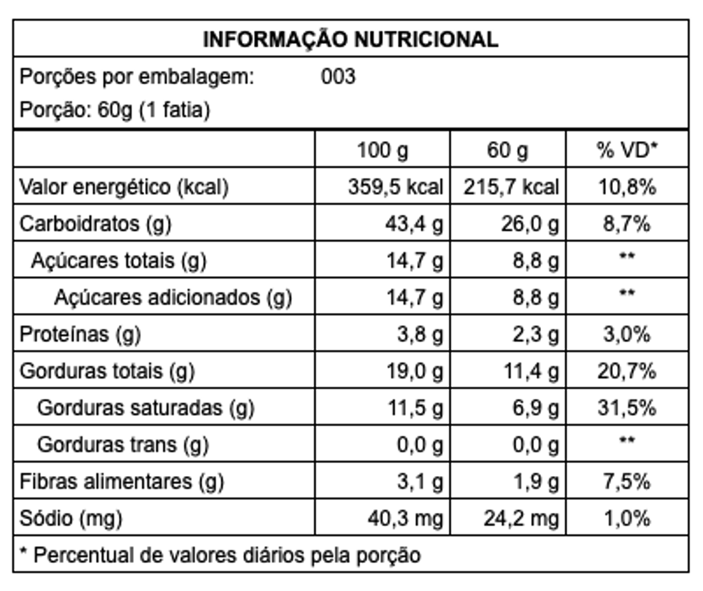
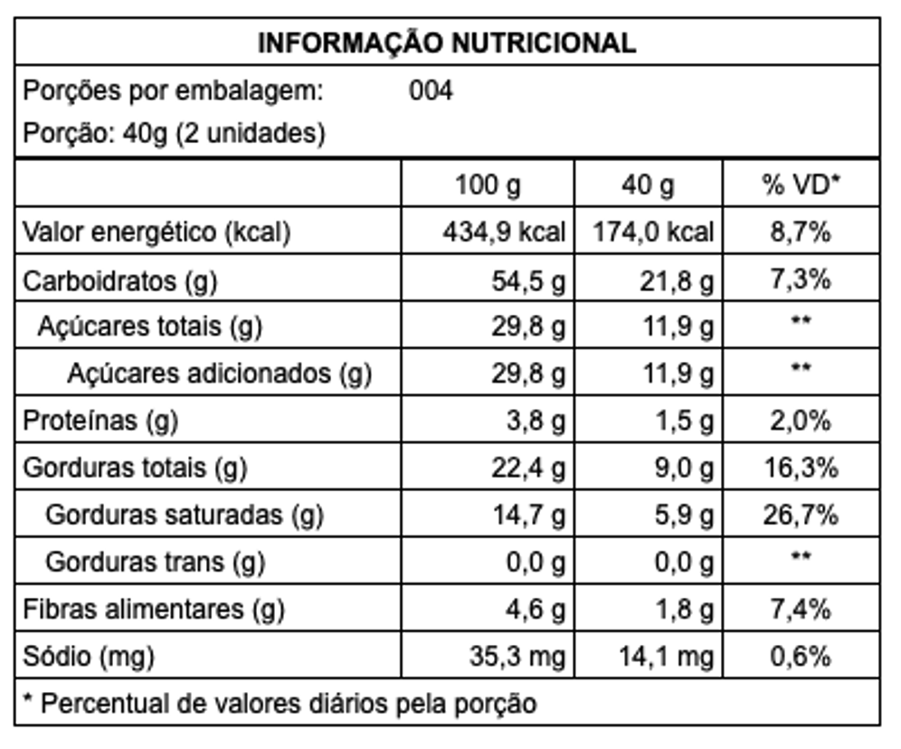

  <h1>Informações Nutricionais</h1>

  

    <h2>Guirlanda de brownie 20cm - 800g</h2>
    <h3>Ingredientes:</h3>
    <ul>
      <li>Farinha de arroz</li>
      <li>Chocolate meio amargo (açúcar, massa de cacau, gordura vegetal, emulsificantes: lecitina de soja e ésteres de ácido ricinoléico interesterificado com poliglicerol e aromatizante)</li>
      <li>Açúcar demerara</li>
      <li>Óleo de coco</li>
      <li>Chocolate em pó</li>
      <li>Fécula de batata</li>
      <li>Farinha de linhaça dourada</li>
      <li>Extrato de baunilha</li>
      <li>Sal</li>
      <li>Goma xantana</li>
    </ul>
    <h3>Recheios e Coberturas:</h3>
    <ul>
      <li>Ganache de chocolate meio amargo (castanha de caju, chocolate meio amargo, água)</li>
      <li>Brigadeiro (castanha de caju, chocolate meio amargo, açúcar demerara, água)</li>
      <li>Granulado (açúcar, massa de cacau, gordura vegetal, emulsificantes: INS 322 e INS 476, aromatizante e glaceante: INS 904)</li>
      <li>Confeitos natalinos (açúcar, glucose, corantes e aromas artificiais)</li>
    </ul>
    
<strong>Alérgicos:</strong> Contém glúten. Contém castanha de caju. Pode conter leite, soja e ovos.

    

      
    

  

  

  

    <h2>Mini Guirlanda de Brownie 10cm - 180g</h2>
    <h3>Ingredientes:</h3>
    <ul>
      <li>Farinha de arroz</li>
      <li>Chocolate meio amargo (açúcar, massa de cacau, gordura vegetal, emulsificantes: lecitina de soja e ésteres de ácido ricinoléico interesterificado com poliglicerol e aromatizante)</li>
      <li>Açúcar demerara</li>
      <li>Óleo de coco</li>
      <li>Chocolate em pó</li>
      <li>Fécula de batata</li>
      <li>Farinha de linhaça dourada</li>
      <li>Extrato de baunilha</li>
      <li>Sal</li>
      <li>Goma xantana</li>
    </ul>
    <h3>Recheio e Cobertura:</h3>
    <ul>
      <li>Ganache de chocolate meio amargo (castanha de caju, chocolate meio amargo, água)</li>
      <li>Confeitos natalinos (açúcar, glucose, corantes e aromas artificiais)</li>
    </ul>
    
<strong>Alérgicos:</strong> Contém glúten. Contém castanha de caju. Pode conter leite, soja e ovos.

    

      
    

  

  

  

    <h2>Brownie Bite - 160g (aprox. 10 unidades)</h2>
    <h3>Ingredientes:</h3>
    <ul>
      <li>Farinha de arroz</li>
      <li>Chocolate meio amargo (açúcar, massa de cacau, gordura vegetal, emulsificantes: lecitina de soja e ésteres de ácido ricinoléico interesterificado com poliglicerol e aromatizante)</li>
      <li>Açúcar demerara</li>
      <li>Óleo de coco</li>
      <li>Chocolate em pó</li>
      <li>Fécula de batata</li>
      <li>Farinha de linhaça dourada</li>
      <li>Extrato de baunilha</li>
      <li>Sal</li>
      <li>Goma xantana</li>
      <li>Confeitos natalinos (açúcar, glucose, corantes e aromas artificiais)</li>
    </ul>
    
<strong>Alérgicos:</strong> Contém glúten. Contém castanha de caju. Pode conter leite, soja e ovos.

  

  

  

    <h2>Tabelas Nutricionais</h2>
    

      
    

  

  <footer class="footer">
    
Fabricado por: Nana Sabor Natural Confeitaria Inclusiva

    
CNPJ: 1234560001-78

    
Informação Nutricional: <strong>Colocar QR Code da tabela nutricional</strong>

    
Email: <a href="mailto:nanasabornatural@gmail.com">nanasabornatural@gmail.com</a>

    
Telefone: (11) 99432-4516

    
São Paulo - SP

    
Fab: ________ &nbsp;&nbsp; Val: ________

    
Produto artesanal - Após aberto consumo imediato

  </footer>

